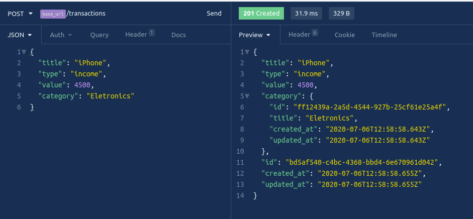
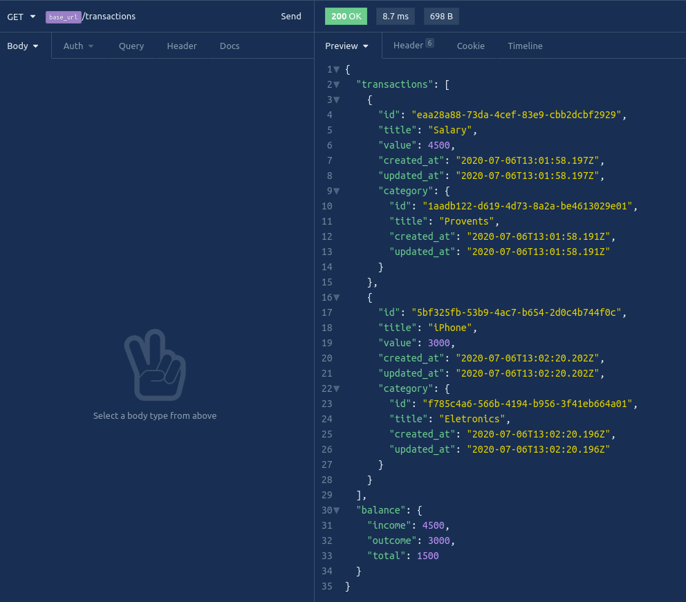
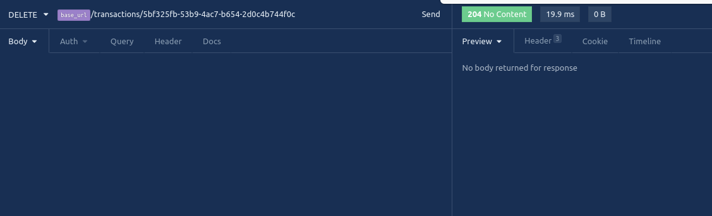
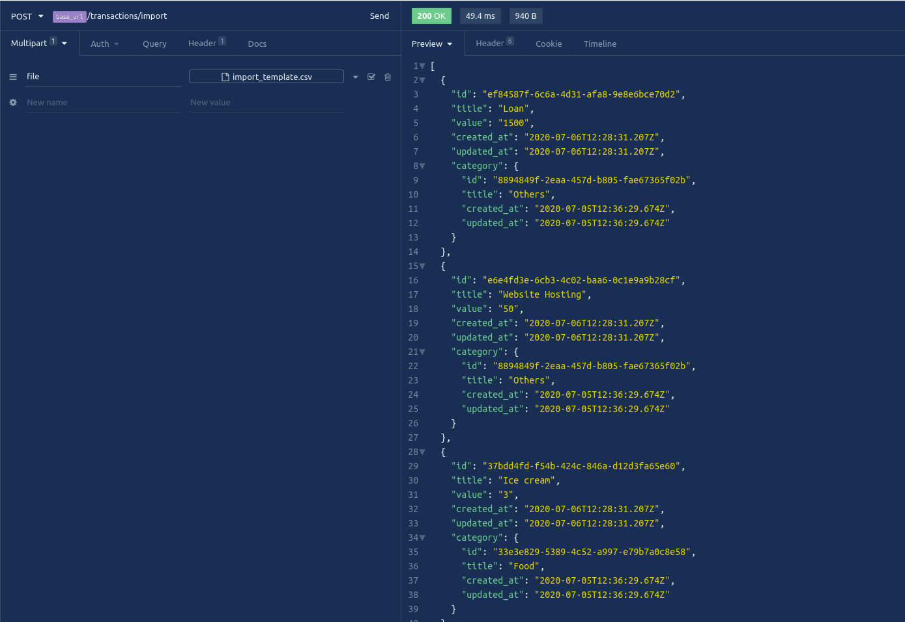

# Repository Like API

An API to control finantials transactions.

## Operations

See the documentation on
[Open API](https://app.swaggerhub.com/apis/bruno8moura/financialtransactions-api/1.0.0)

### Create transaction

### List all transactions

### Delete a transaction

### Import transactions from a csv file

#### CSV Format
title, type, value, category

Loan, income, 1500, Others

Website Hosting, outcome, 50, Others

Ice cream, outcome, 3, Food

## Why

That project is the second challenge from the course Go Stack from [Rocket Seat](https://github.com/Rocketseat). And I'm adding this project for my personal portifolio, so if you could let me any feedback I'd appreciate so much. Any comment that can make me a better programmer will be help a lot!

And for sure, you can use this Project as you wish!

It's free!

## Contact info

My [LinkedIn](https://www.linkedin.com/in/bruno8moura/)

My email bruno8moura@gmail.com

## Getting started

### Prerequisites

NodeJS version: ^12

## Running application

yarn start

## Build with

- [express](https://www.npmjs.com/package/express) - Creates an abstraction layer on NodeJS features, in order to facilitate the creation of web solutions.
- [uuidv4](https://www.npmjs.com/package/uuidv4) - A library for generating 128-bit alphanumeric identifiers.
- [jest](https://www.npmjs.com/package/jest) - A lib for unit tests.
- [supertest](https://www.npmjs.com/package/supertest) - A lib to facilitate http applications tests.
- [ts-jest](https://www.npmjs.com/package/ts-jest) - Is a TypeScript preprocessor with source map support for Jest that lets you use Jest to test projects written in TypeScript.
- [csv-parse](https://www.npmjs.com/package/csv-parse) - A parser converting CSV text input into arrays or objects.
- [dotenv](https://www.npmjs.com/package/dotenv) -  Loads environment variables from a .env file into process.env.
- [express-async-errors](https://www.npmjs.com/package/express-async-errors) - Enable express to deal with async errors.
- [multer](https://www.npmjs.com/package/multer) - Facilitates the workload when working with upload files.
- [pg](https://www.npmjs.com/package/pg) - Client for PostgreSQL database.
- [reflect-metadata](https://www.npmjs.com/package/reflect-metadata) - Enable the ability for the ECMScript to add metadata to classes through annotations just like Java and .net do.
- [typeorm](https://www.npmjs.com/package/typeorm) - An ORM to Nodejs.
- [cross-env](https://www.npmjs.com/package/cross-env) - Run scripts that set and use environment variables across platforms(Windows, Linux, etc).
- [ts-node](https://www.npmjs.com/package/ts-node) - Enable typescript use into Nodejs.
- [ts-node-dev](https://www.npmjs.com/package/ts-node-dev) - When developing apps, this module enable live reloading for typescript.
- [typescript](https://www.npmjs.com/package/typescript) - Core lib for the use of Typescript language.
- [eslint](https://www.npmjs.com/package/eslint) - Pattern the code style and create patterns rules for code in order to facilitate the development.
- [eslint-config-airbnb-base](https://www.npmjs.com/package/eslint-config-airbnb-base) - A bunch of rules created by Airbnb for ESLint.
- [prettier](https://www.npmjs.com/package/prettier) - A code formatter.
- [eslint-config-prettier](https://www.npmjs.com/package/eslint-config-prettier) - Turns off all rules that are unnecessary or might conflict with Prettier.
- [eslint-plugin-prettier](https://www.npmjs.com/package/eslint-plugin-prettier) - Runs Prettier as an ESLint rule and reports differences as individual ESLint issues.
- [eslint-plugin-import](https://www.npmjs.com/package/eslint-plugin-import) - This plugin intends to support linting of ES2015+ (ES6+) import/export syntax, and prevent issues with misspelling of file paths and import names.
- [eslint-import-resolver-typescript](https://www.npmjs.com/package/eslint-import-resolver-typescript) - This plugin adds TypeScript support to eslint-plugin-import.
- [@typescript-eslint/eslint-plugin](https://www.npmjs.com/package/@typescript-eslint/eslint-plugin) - An ESLint plugin which provides lint rules for TypeScript codebases.
- [@typescript-eslint/parser](https://www.npmjs.com/package/) - Allow the use of rules defined into ESLint in Typescript.
- [@types/csv-parse](https://www.npmjs.com/package/) - Enable the use of intellisense for the module csv-parse.
- [@types/express](https://www.npmjs.com/package/) - Enable the use of intellisense for the module express.
- [@types/](https://www.npmjs.com/package/) - Enable the use of intellisense for the module express-serve-static-core.
- [@types/jest](https://www.npmjs.com/package/) - Enable the use of intellisense for the module jest.
- [@types/multer](https://www.npmjs.com/package/) - Enable the use of intellisense for the module multer.
- [@types/supertest](https://www.npmjs.com/package/) - Enable the use of intellisense for the module supertest.
